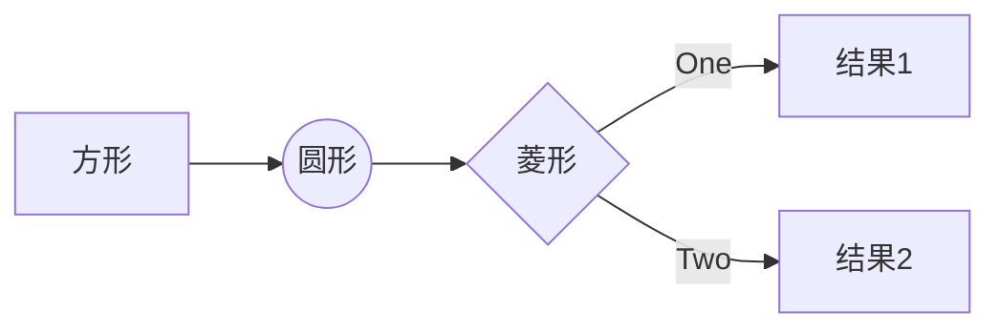

<!-- 这是一个关于slidev的介绍 -->

# Slidev

开发者使用的幻灯片工具

---
layout: center
---

# Slidev 是一个为开发者设计的幻灯片制作和演示工具，具有以下特点：

- 📝 **基于文本** - 用 Markdown 来专注于内容，然后再来美化它们
- 🎨 **可主题化** - 主题可以通过 npm 包来分享和使用
- 🧑‍💻 **开发者友好** - 代码高亮，实时编码和自动补全
- 🤹 **可交互** - 嵌入 Vue 组件来增强你的表达
- 🎥 **可录制** - 内置录制和相机视图
- 📤 **可移植** - 导出为 PDF，PNG 或者甚至是可托管的 SPA
- 🛠 **可定制** - 任何在网页上都可以做到的事情

<br>

---

# 初始化一个 Slidev 项目

## npm:

```bash
npm init slidev
```

## yarn:

```bash
yarn create slidev
```

## pnpm:

```bash
pnpm create slidev
```

<br >

全局安装 slidev cli

```bash
npm i -g @slidev/cli
```

---

# 项目结构

```bash
├── components
│   └── Counter.vue
├── pages
│   └── multiple-entries.md
├── slides.md
```

- **components** - 放置自定义的 Vue 组件
- **pages** - 放置多页幻灯片文件
- **slides.md** - 默认的 PPT 文件。 可以带参数执行 slidev slides.md，指定要展示的 PPT

---

# Markdown 语法

## 分页

```md
---
```

```md
# Slidev

Hello, World!

---

# Page 2

你可以直接使用 Windi CSS(unoCSS) 和 Vue 组件来美化你的幻灯片。

<div class="p-3">
  <Tweet id="20" />
</div>
```

---

# Markdown 语法

## 布局和元数据

```txt
---
layout: cover
---

# Slidev

这是封面页

---
layout: center
background: './images/background-1.png'
class: 'text-white'
---​

# Page 2
中文：这是一个带有 `center` 布局和背景图片的页面。

---

# Page 3
这是一个没有任何元数据的默认页面。
```

---

# Markdown 语法

## 代码高亮

````txt
 ```js {1,3|4-6}
 import { createApp } from 'vue'
 import Slidev from '@slidev/client'
 // 先高亮
 const app = createApp(Slidev)

 app.mount('#app')
 ```
````

```js {1,3|4-6}
import { createApp } from 'vue'
import Slidev from '@slidev/client'
// 先高亮
const app = createApp(Slidev)

app.mount('#app')
```

---

# Markdown 语法

## 可编辑的代码块

````txt
 ```js {monaco}
 import { createApp } from 'vue'
 import Slidev from '@slidev/client'

 const app = createApp(Slidev)

 app.mount('#app')
 ```
````

```js {monaco}
import { createApp } from 'vue'
import Slidev from '@slidev/client'

const app = createApp(Slidev)

app.mount('#app')
```

---

# Markdown 语法

## 编辑并对比

````txt
  ```txt {monaco-diff}
  This line is removed on the right.
  just some text
  abcd
  efgh
  Some more text
  ~~~
  just some text
  abcz
  zzzzefgh
  Some more text.
  This line is removed on the left.
  ```
````

```txt {monaco-diff}
This line is removed on the right.
just some text
abcd
efgh
Some more text
~~~
just some text
abcz
zzzzefgh
Some more text.
This line is removed on the left.
```

---

# Markdown 语法

## 内嵌样式

可以在每个页面嵌入样式(style 都是scoped)，不会影响其他页面。

```txt
### 红色标题

<style>
h3 {
  color: red
}
</style>
```

### 红色标题

<style>
h3 {
  color: red
}
</style>

---

# Markdown 语法

## 静态资源

- 非本地资源，会在第一次运行的时候由 `vite-plugin-remote-assets` 下载到本地。
```txt

```


---

# Markdown 语法

## 静态资源

- 本地资源
```txt

```


---

# Markdown 语法

## 静态资源

- 如果想要设置样式
```txt

```


---

# 用于演讲者模式的笔记

```txt
---
layout: cover
---

# Page 1

This is the cover page.

<!-- 这是一个笔记 -->

---
```


<!-- 这是一个笔记 -->

---

# 图标

## slidev可以使用[`Iconify`](https://iconify.design!) 的任意图标，格式如下：

{collection-name}-{icon-name}

- `<mdi-account-circle />` - <mdi-account-circle />
- `<carbon-badge />` - <carbon-badge />
- `<uim-rocket />` - <uim-rocket />
- `<twemoji-cat-with-tears-of-joy />` - <twemoji-cat-with-tears-of-joy />
- `<logos-vue />` - <logos-vue />
- 还有非常多...

<style>
  code {
    color: #fca311;
  }
</style>

---

# 图标

## 带样式的图标

```txt
<uim-rocket />
<uim-rocket class="text-3xl text-red-400 mx-2" />
<uim-rocket class="text-3xl text-red-400 mx-2 animate-ping" />
```

<uim-rocket />
<uim-rocket class="text-3xl text-red-400 mx-2" />
<uim-rocket class="text-3xl text-red-400 mx-2 animate-ping" />

---
layout: two-cols
---

<template v-slot:default>

# 插槽

有些布局支持插槽，就是Vue的插槽。

```txt
---
layout: two-cols
---

<template v-slot:default>

# 插槽

这些内容就是左边的内容

</template>
<template v-slot:right>

# 这是右边

这是右边的内容

</template>
```

</template>

<template v-slot:right>

# 这是右边 

这是右边的内容

</template>

---
layout: two-cols
---

# 插槽

可以使用语法糖来使用插槽

```txt
---
layout: two-cols
---

# 插槽

可以使用语法糖来使用插槽

::right::

# 这是右边

这是右边的内容
```

::right::

# 这是右边

这是右边的内容

---
layout: two-cols
---

::right::

# 这是右边

这是右边的内容

::default::

# 插槽

可以使用::default::来指定默认插槽

```txt
---
layout: two-cols
---

::right::

# 这是右边

这是右边的内容

::default::

# 插槽

可以使用::default::来指定默认插槽
```

---

# 配置

```txt
---
theme: seriph
layout: cover
backgroundColor: 'https://sli.dev/favicon.png'
---

# Slidev

这是一个幻灯片
```

详细配置请参考Frontmatter Configures [官方文档](https://sli.dev/custom/#frontmatter-configures) 

---

# LaTeX

LaTeX由[KaTeX](https://katex.org/)渲染

- 在行内使用LaTeX, 使用`$`包裹: $\sqrt{3x-1}+(1+x)^2$

```txt
$\sqrt{3x-1}+(1+x)^2$
```

<br>

- 整段LaTeX，使用`$$`包裹:

```txt
$$
\begin{array}{c}

\nabla \times \vec{\mathbf{B}} -\, \frac1c\, \frac{\partial\vec{\mathbf{E}}}{\partial t} &
= \frac{4\pi}{c}\vec{\mathbf{j}}    \nabla \cdot \vec{\mathbf{E}} & = 4 \pi \rho \\

...
$$
```

$$
\begin{array}{c}

\nabla \times \vec{\mathbf{B}} -\, \frac1c\, \frac{\partial\vec{\mathbf{E}}}{\partial t} &
= \frac{4\pi}{c}\vec{\mathbf{j}}    \nabla \cdot \vec{\mathbf{E}} & = 4 \pi \rho \\

\nabla \times \vec{\mathbf{E}}\, +\, \frac1c\, \frac{\partial\vec{\mathbf{B}}}{\partial t} & = \vec{\mathbf{0}} \\

\nabla \cdot \vec{\mathbf{B}} & = 0

\end{array}
$$

---

# 图表

可以创建图表，由[Mermaid](https://mermaid.js.org/)渲染

````txt
  ```mermaid
  graph LR
    A[方形] --> B((圆形))
    B --> C{菱形}
    C -->|One| D[结果1]
    C -->|Two| E[结果2]
  ```
````



---

# 图表

可以配置样式

````txt
  ```mermaid {theme: 'forest', scale: 0.8}
  graph LR
    A[方形] --> B((圆形))
    B --> C{菱形}
    C -->|One| D[结果1]
    C -->|Two| E[结果2]
  ```
````


---

# 拆分为多个md文件
  
```txt
# 页面1

---
src: ./subpage1.md
---

```

---
layout: two-cols
---

# 拆分为多个md文件

可以修改页面的元数据，但是主页面的元数据优先级高于外部子页面的元数据

`slides.md`

```txt
---
src: ./subpage1.md
background: https://sli.dev/favicon.png
class: text-center
---
```

`subpage1.md`

```txt
---
layout: cover
background: https://sli.dev/foo.png
---
```

::right::

元数据合成为
```txt
---
layout: cover
background: https://sli.dev/favicon.png
class: text-center
---
```

---

# 页面重用

```txt
---
src: ./subpage1.md
---

---
src: ./subpage1.md
---
```
